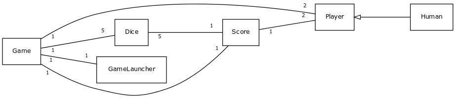
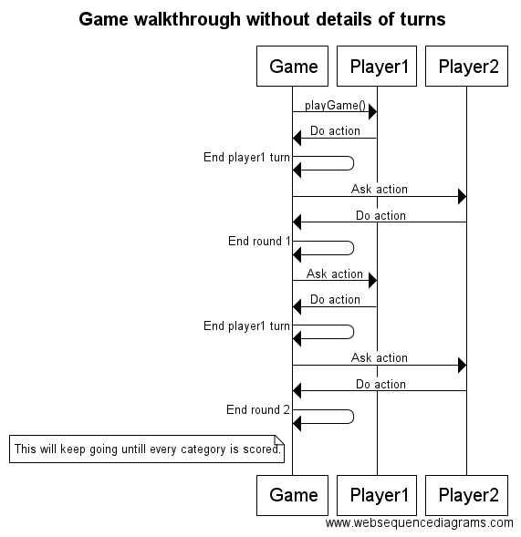
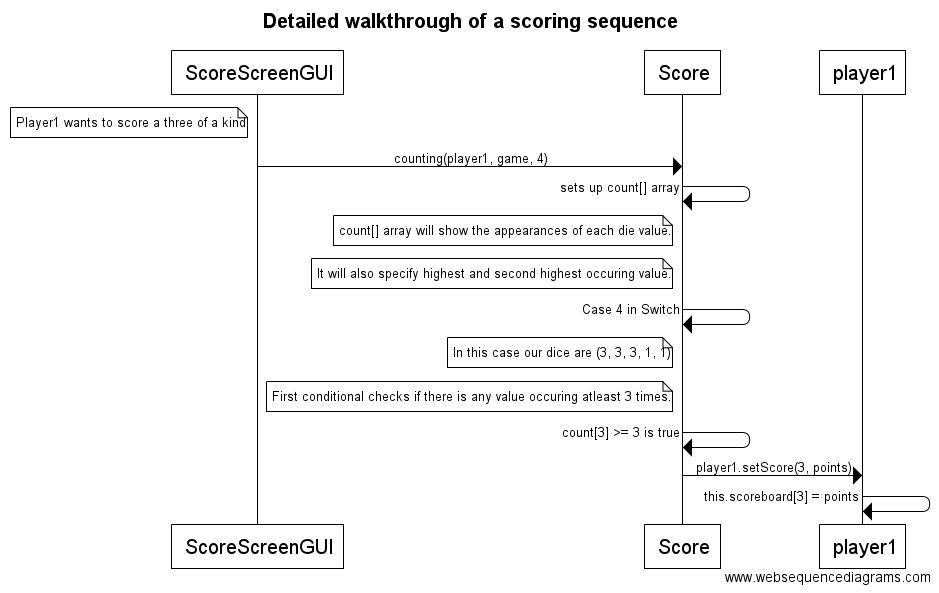

## Topic: Yatzy (Yahtzee)

I create game that is based on rolling the dive and using their values for scoring. Idea is that each player on their turn rolls five dice and values you get are used for scoring in certain categories. Winner is the player with highest total score.

Game will have single-player against AI and local multiplayer with other humans. Game will also have some sort of high score list for keeping track of best performances.

**Users:** Players 

## Player's actions:
* playing against humans

## Class diagram:

## Sequence diagrams:

## Structure description:

Game gets started by GameLauncher class, which calls for new class Game. Game class now initializes game environment which requires players and scoring to be connected. Classes Player and Score will be called during the initialization. All this information is passed for GameScreenGUI class to be utilized as data for GUI.

Before game starts, players get a quick how-to-play by popup InfoScreenGUI. During every turn, dice from Dice class will be modified and their values will be used in Score class to specify scoring value of the dice value. After this, the point information is being sent to Player object to store one's score. ScoringScreenGUI shows this event for player. After both players have scored 13 categories, players will see EndScreenGUI, which includes information of a game's winner.

## Instructions:

Game is very simple to use. Start up the jar file in directory and follow the rules given in game. Rules and how to play will popup when game is started, but here they are in short:
* You try to score each category with 2 rerolls each turn. During each reroll you are allowed to throw every dice.
* You will be forced to score after 2 rerolls (not including round starting reroll), unless you have pressed Score by yourself earlier.
* Score fitting category when the screen is presented to you.
* Next player's turn will start by pressing Reroll after scoring event.
* This will keep going for 13 turns per player and after that there will be an end screen with results. You can exit the game by pressing 'Exit' button.
