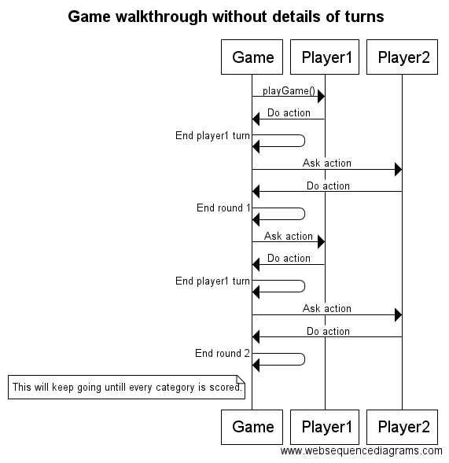
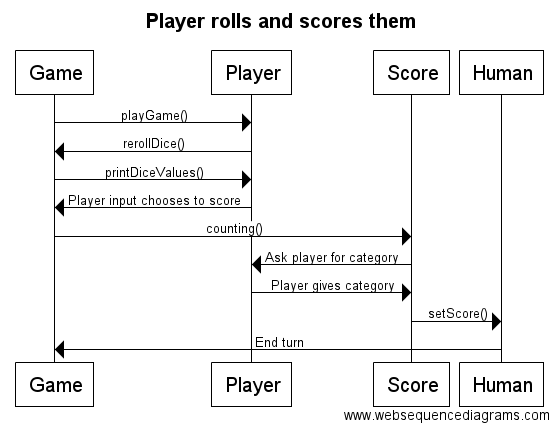

## Topic: Yatzy (Yahtzee)

I create game that is based on rolling the dive and using their values for scoring. Idea is that each player on their turn rolls five dice and values you get are used for scoring in certain categories. Winner is the player with highest total score.

Game will have single-player against AI and local multiplayer with other humans. Game will also have some sort of high score list for keeping track of best performances.

**Users:** Players 

## Player's actions:
* playing against AI and humans
* inspecting high score list

## Class diagram:

## Sequence diagrams:

