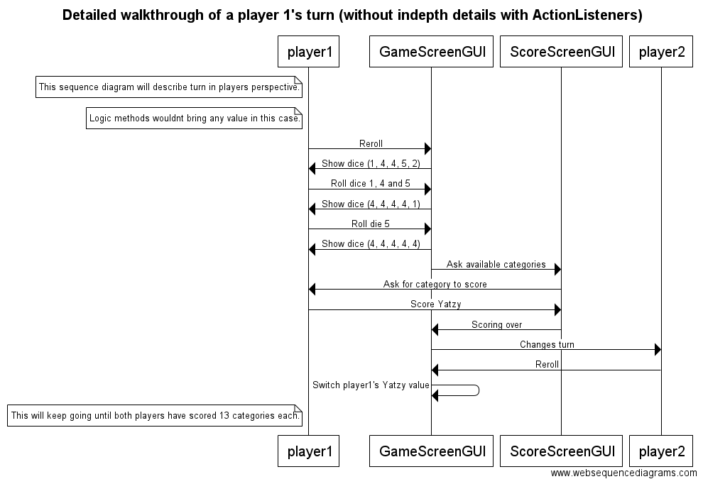

## Topic: Yatzy (Yahtzee)

I create game that is based on rolling the dive and using their values for scoring. Idea is that each player on their turn rolls five dice and values you get are used for scoring in certain categories. Winner is the player with highest total score.

Game will have single-player against AI and local multiplayer with other humans. Game will also have some sort of high score list for keeping track of best performances.

**Users:** Players 

## Player's actions:
* playing against AI and humans
* inspecting high score list

## Class diagram:

## Sequence diagrams:

## Structure description:

Game gets started by GameLauncher class, which calls for new class Game. Game class now initializes game environment which requires players and scoring to be connected. Classes Player and Score will be called during the initialization. During every turn, dice from Dice class will be modified and their values will be used in Score class to specify scoring value of the dice value. 

After this, the point information is being sent to Player object to store one's score. After the game is over, scoring class sends the high scores for HighScore class, which saves the best results in a text file.

## Instructions:

Game is very simple to use. Start up the jar file in directory and follow the rules given in game.
